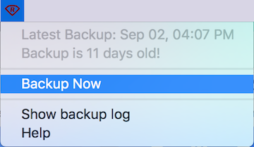

# Restic.spoon
Hammerspoon module to manage restic backups with the menu bar



### Installation
Install the spoon with:

```bash
git clone https://github.com/icgood/Restic.spoon.git ~/.hammerspoon/Spoons/Restic.spoon
```

### Configuration

Update your `~/.hammerspoon/init.lua` with the following:

```lua
hs.loadSpoon("Restic")
spoon.Restic:setRepository("s3:s3.amazonaws.com/bucket_name")
spoon.Restic:setPassword("<restic-repo-password>")
spoon.Restic:setS3Credentials("<aws-access-key>", "<aws-secret-key>")
spoon.Restic:start()
```

Finally, reload your Hammerspoon config to see Restic.spoon in the menu bar.

See _Help_ in the menu bar for documentation on additional settings and console
commands.

#### Save/Load

Once you have a working configuration, save them to `~/restic.spoon` from the
Hammerspoon console:

```lua
spoon.Restic:saveSettings()
```

You can then modify your `~/.hammerspoon/init.lua` script and replace all of
the spoon initialization with:

```lua
hs.loadSpoon("Restic"):start()
```
